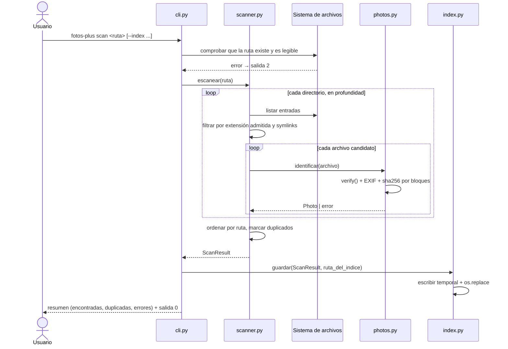

# Design

## Context

Ver `proposal.md` para la motivación. El repositorio está vacío salvo el README: no hay
código, ni `pyproject.toml`, ni convenciones de código todavía. Este cambio es el que
define la estructura de paquetes, la dependencia de lectura de imágenes y el formato del
inventario, así que las decisiones de layout que se tomen aquí valen para los cambios
siguientes (organización por fechas, lugares, personas y visualizador).

Restricción del proyecto: stack Python, persistencia en PostgreSQL, pruebas con
`pytest`, y trabajo en ramas `feature/<nombre-del-cambio>`.

## Goals / Non-Goals

**Goals:**

- Dejar una estructura de proyecto (empaquetado, CLI, código testeable) que los
  cambios siguientes puedan extender sin reorganizar nada.
- Obtener un inventario determinista y reproducible de una carpeta, con errores
  puntuales que no cortan el recorrido.
- Dejar el formato del índice versionado, para que la migración futura a PostgreSQL
  tenga una entrada conocida.

**Non-Goals:**

- No se organizan, mueven ni renombran archivos (ver los requisitos en
  `specs/photo-scanning/spec.md`).
- No se leen coordenadas GPS, no se generan miniaturas ni se detectan personas: la
  geolocalización y el reconocimiento facial son cambios aparte.
- No se conecta PostgreSQL todavía.
- No hay escaneo incremental, paralelismo ni caché entre corridas.

## Decisions

### Estructura del proyecto

`pyproject.toml` (setuptools, PEP 621) con el paquete `fotos_plus/` y un entry point de
consola `fotos-plus`. Módulos:

- `fotos_plus/cli.py`: parsing de argumentos y códigos de salida.
- `fotos_plus/scanner.py`: recorrido del sistema de archivos y orquestación.
- `fotos_plus/photos.py`: identificación de fotos, lectura de EXIF y hash.
- `fotos_plus/index.py`: lectura/escritura del índice local.
- `fotos_plus/models.py`: dataclasses `Photo` y `ScanResult`.

Se evaluó un único módulo por simplicidad, pero separar "recorrer disco" de "leer
metadatos" mantiene el escaneo testeable con archivos falsos y deja un punto claro donde
enchufar el geolocalizador más adelante.

### Identificación de una foto: extensión primero, contenido después

El recorrido filtra por extensión contra una lista explícita de formatos admitidos
(`.jpg`, `.jpeg`, `.png`, `.heic`, `.heif`, `.webp`, `.tif`, `.tiff`, `.dng`, `.nef`,
`.cr2`, `.arw`) y luego confirma con `PIL.Image.verify()` que el contenido sea una imagen
decodificable. La lista de extensiones se expone en el subcomando para que sea
consultable.

- **Alternativa descartada**: `mimetypes` sobre el contenido, porque no distingue
  `image/heic` de otros y obliga a leer cada archivo entero.
- **Alternativa descartada**: confiar solo en la extensión, porque acepta archivos
  renombrados o corruptos y rompería el requisito de no inventar fotos.

Excepciones: Pillow no decodifica HEIC sin el plugin `pillow-heif` ni los RAW de Nikon,
Canon y Sony. Para esos formatos se acepta la extensión como prueba suficiente y se
intentan las lecturas de EXIF disponibles; si no se puede leer EXIF, la foto se registra
igual con la fecha vacía y se emite un aviso. La lista de formatos con lectura completa
vs. parcial queda centralizada en una constante.

### Fecha de captura

Se lee `DateTimeOriginal` (0x9003) de EXIF y, si falta, `DateTime` (0x0132). Se registra
en ISO 8601 sin zona horaria, porque EXIF no la guarda, y el índice no completa el dato
con la hora de modificación del archivo: el índice distingue explícitamente "no había
fecha" de "había fecha", y usar `mtime` mezclaría ambos casos y rompería la agrupación
posterior por fecha.

### Hash de contenido

SHA-256 calculado por bloques de 1 MiB, sin cargar el archivo entero en memoria.

- **Alternativa descartada**: MD5 o BLAKE3 por velocidad; con archivos de fotos de varios
  MB la diferencia no compensa, y SHA-256 evita la objeción de los hashes de trabajo.
- Los grupos de duplicados se forman por hash al final del recorrido, cuando ya se
  conoce todo el conjunto. La copia se elige por ruta relativa más corta para que el
  resultado sea estable entre corridas.

### Índice local en JSON

Un solo archivo JSON con la forma:

```json
{
  "version": 1,
  "root": "C:/fotos/vacaciones",
  "scanned_at": "2026-09-28T14:03:11",
  "photos": [
    {
      "relative_path": "2024/playa/IMG_0001.jpg",
      "name": "IMG_0001.jpg",
      "extension": ".jpg",
      "size_bytes": 3145728,
      "sha256": "…",
      "captured_at": "2024-07-15T18:22:04",
      "captured_at_source": "exif-datetime-original",
      "duplicate_of": null
    }
  ],
  "errors": [{"relative_path": "rota.jpg", "error": "unreadable image"}]
}
```

- **Alternativa descartada**: SQLite. Resiste mejor bibliotecas enormes (consultas sin
  cargar todo en memoria), pero agrega un motor que hay que migrar después a PostgreSQL
  sin ganar nada: el índice de esta etapa no se consulta de forma interactiva.
- **Alternativa descartada**: JSON Lines. Es más fácil de escribir de a una foto, pero
  pierde la estructura de cabecera y obliga a leer el archivo entero para conocer el
  resultado de un escaneo.
- El campo `version` permite migrar el índice cuando el formato cambie.
- La escritura es atómica: se escribe a un archivo temporal en el mismo directorio y se
  renombra con `os.replace`, para que un escaneo interrumpido no deje un índice a medias.

### Ubicación del índice

Por defecto en un directorio de estado del usuario
(`~/.fotos-plus/indexes/` en Unix, `%LOCALAPPDATA%\fotos-plus\indexes\` en Windows),
con un nombre derivado de un hash de la ruta absoluta de la carpeta raíz. Así el índice
no ensucia la carpeta de fotos del usuario, y la ruta sigue siendo determinista, lo que
permite reemplazar el índice anterior de esa carpeta sin llevar un registro aparte.
`--index` permite elegir otra ubicación, por ejemplo dentro del propio proyecto durante
el desarrollo.

### Simbolos y determinismo

No se siguen los enlaces simbólicos de directorio, para evitar ciclos; los de archivo se
aceptan. Las fotos del inventario se ordenan por ruta relativa, de modo que dos
escaneos de la misma carpeta produzcan índices idénticos salvo `scanned_at`.

### Errores y códigos de salida

Los errores por archivo se acumulan en `errors` y el escaneo continúa. Códigos: `0`
escaneo terminado (aunque haya errores por archivo, que se informan), `1` argumentos
inválidos, `2` la ruta indicada no existe o no se puede leer.

## Flujo de escaneo



## Riesgos / Trade-offs

- [HEIC y RAW quedan con metadatos parciales] → Se documenta qué formatos se leen
  completo y cuáles solo por extensión; agregar `pillow-heif` más adelante es un cambio
  aislado si el volumen de HEIC lo justifica.
- [Una biblioteca muy grande no entra cómodo en memoria al armar el JSON] → El escaneo
  streaming por bloques y la escritura atómica evitan el peor caso; si aparece el
  problema, el salto a JSON Lines o SQLite no cambia los requisitos.
- [El índice local duplica el modelo que vivirá en PostgreSQL] → Se mitiga con
  `version: 1`, dataclasses propias y ninguna consulta al índice desde el código de
  negocio, de modo que la carga hacia PostgreSQL sea una translation y no una
  reescritura.
- [EXIF no tiene zona horaria y las cámaras suelen tener la hora mal configurada] → Se
  guarda la fecha tal cual, sin corregir, y el agrupamiento por fechas es un cambio
  posterior que puede aplicar la corrección.
- [Escanear varias veces recalcula todos los hashes] → Aceptado: el escaneo incremental
  queda fuera de alcance y es una optimización futura que no cambia los requisitos.
- [`Image.verify()` con archivos muy grandes consume tiempo] → Se acepta el costo en la
  primera versión; la verificación completa se puede hacer opcional más adelante.

## Migration Plan

No hay migración: es el primer código del proyecto y PostgreSQL no se toca. El índice
local es regenerable, así que una versión fallida se descarta y se vuelve a escanear.

Despliegue: publicar el paquete, ejecutar `fotos-plus scan <carpeta>`.

Rollback: revertir la rama de la funcionalidad; el único rastro en disco es el archivo
de índice, que se borra a mano. Ver `proposal.md` para el detalle.

## Open Questions

- ¿Conviene escanear en paralelo cuando la biblioteca crece a decenas de miles de fotos?
  Se puede decidir al medir, sin cambiar los requisitos.
- ¿El índice debe conservarse por siempre o archivarse cuando la carpeta desaparece de
  disco? Es política de producto del visualizador, no del escaneo.
