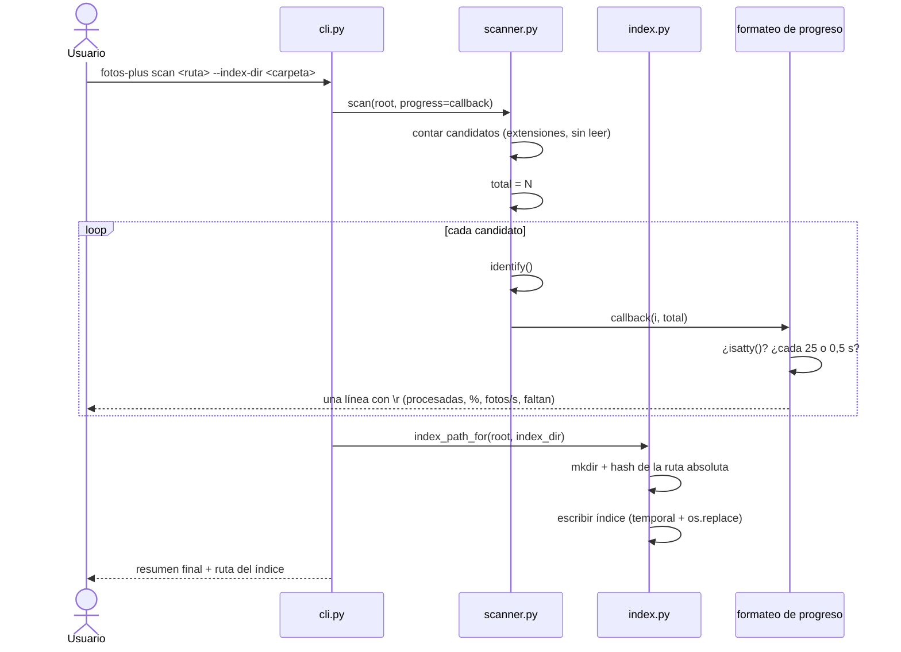

# Design

## Context

Ver `proposal.md` para la motivación. La implementación actual ya escanea, identifica y
escribe el índice, y está cubierta por 40 pruebas en `fotos_plus/` y `tests/`.

Dos hechos del código condicionan el diseño:

- `scanner.scan(root)` recorre el árbol y procesa cada archivo en un único `for`, sin
  conocer el total de candidatos de antemano. Para dar porcentaje hace falta el total.
- `index.default_index_path(root)` ya deriva un nombre determinista de la ruta absoluta
  con SHA-256, dentro del directorio de estado del usuario. La carpeta de destino tiene
  que cambiar dónde se busca ese directorio, no cómo se calcula el nombre.

## Goals / Non-Goals

**Goals:**

- Permitir elegir la carpeta de destino de los índices sin tocar el nombre del archivo ni
  el formato del índice.
- Dar una señal de avance útil en un escaneo de varios minutos, sin ensuciar la salida
  cuando no hay terminal.
- Dejar el lanzador `fotos-plus.bat` cubierto por pruebas, sin cambiar su comportamiento.

**Non-Goals:**

- No se agrupan los índices por subcarpeta ni se adopts una convención de nombres legible
  (el hash se mantiene porque evita colisiones y caracteres inválidos en Windows).
- No se agrega paralelismo ni escaneo incremental: la lentitud se informa, no se resuelve.
- No se escribe progreso a un archivo de log.
- No se cambia la salida de los resúmenes ya existente más allá de lo necesario.

## Decisions

### Resolución de la ruta del índice en un solo lugar

`default_index_path(root)` pasa a recibir la carpeta destino opcionalmente:
`index_path_for(root, index_dir=None)`. Si viene `index_dir`, se usa como directorio
padre del mismo nombre derivado del hash; si no, se usa el directorio de estado del
usuario. La carpeta se crea con `mkdir(parents=True, exist_ok=True)`, que ya hace
`write_index`.

- **Alternativa descartada**: dejar la decisión en la CLI y concatenar rutas ahí. Se
  duplicaría el hash del nombre en dos lugares y la próxima capacidad (por ejemplo, el
  visualizador) no encontraría dónde está el índice.
- `--index` se resuelve antes: si viene un archivo, gana sobre `--index-dir`. La CLI pasa
  solo uno de los dos a la función de resolución.

### El total de candidatos, sin recorrer dos veces

`scan()` recibe un `progress` opcional y, antes de procesar, cuenta los candidatos con
una pasada barata de `scandir` que solo mira extensión. El conteo no lee ni hashea
nada, así que sobre 4.927 archivos es imperceptible frente al hasheo de 32 GB.

- **Alternativa descartada**: porcentaje sobre el total de archivos de la carpeta. Engaña:
  mezcla no-fotos con fotos y el número nunca llega al 100%.
- **Alternativa descartada**: recorrer el árbol dos veces de verdad, la segunda con
  `identify`. Duplica el trabajo más caro.
- Cuando el total es 0, no se emite progreso: se cae en el caso "carpeta sin fotos" del
  spec, que ya tiene su propio mensaje.

### Callback de progreso en vez de escribir en la consola desde el scanner

`scan(root, progress=None)` donde `progress` es un callable
`(processed: int, total: int) -> None`. El scanner no sabe nada de terminales: solo
notifica. La CLI formatea y decide si imprimir.

- **Alternativa descartada**: que `scanner` imprima directo. Rompe el aislamiento de
  Responsibility que permite probarlo con `capsys` y lo ata a la consola.
- Los errores de la callback se ignoran: el progreso nunca debe abortar un escaneo.

### Formato y ritmo del progreso

Una sola línea con `\r`, sin salto de línea, escrita en `stdout`:
`Escaneando... 1200/4927 (24%) - 18.3 fotos/s - faltan 3m 22s`. Se refresca cada 25 fotos
o 0,5 s, lo que ocurra primero, y siempre se emite una línea final antes del resumen para
que la consola no quede con la línea a medias. Cada línea se rellena con espacios hasta
el ancho de la más larga ya escrita, para que una línea más corta no deje restos de la
anterior.

- **Alternativa descartada**: mensaje cada X segundos en líneas nuevas. Ensuciaría el log
  y complicaría el test del resumen.
- **Alternativa descartada**: barra con caracteres de relleno. Se ve bien en un terminal
  real pero no agrega información y complica el test.
- **Tiempo restante**: se calcula con la velocidad media de los últimos archivos, no con
  la del inicio, para que un disco lento al principio no proyecte un tiempo irreal. Si
  aún no hay muestras suficientes, se muestra `faltan ?` en lugar de un número inventado.
- La detección de terminal usa `sys.stdout.isatty()`, y también se desactiva con
  `FOTOS_PLUS_NO_PROGRESS=1` para las pruebas y para quien prefiera el silencio. Esa
  variable no es parte del contrato del spec: es una comodidad de desarrollo.

### El lanzador se prueba, no se rediseña

`fotos-plus.bat` ya funciona. Se le agrega una prueba que lo ejecute con
`subprocess` sobre una carpeta temporal, verificando que sin subcomando escanea igual que
con `scan` y que propaga el código de salida. No se le agrega `--quiet` ni nada nuevo: su
única lógica es resolver el subcomando implícito y delegar.

- **Alternativa descartada**: mover esa lógica al paquete Python (un alias `scan` por
  defecto). El `.bat` es deliberadamente trivial; si la CLI se complica, el lanzador se
  queda atrás y hay que tocarlo igual.

## Flujo de escaneo con destino y progreso

## Riesgos / Trade-offs

- [La cuenta de candidatos recorre el árbol dos veces] → La primera pasada solo hace
  `scandir` y compara extensiones; el costo es despreciable frente a hashear 32 GB, y se
  mide con un test de tiempo relativo solo si algún día molesta.
- [El hash del nombre no es legible] → Se acepta: garantiza unicidad y evita caracteres
  inválidos en Windows. Si más adelante hay muchos índices, se puede agregar un prefijo
  con el nombre de la carpeta sin cambiar el formato.
- [El tiempo restante miente cuando el throughput es irregular] → Se calcula con las
  muestras recientes y se muestra `faltan ?` hasta tener suficientes; es una estimación,
  no una promesa.
- [`\r` en la salida confunde a quien captura la consola] → Por eso el progreso se
  desactiva solo sin terminal y con `FOTOS_PLUS_NO_PROGRESS=1`.
- [`--index` y `--index-dir` juntos son ambiguos] → Se resuelve con una prioridad fija
  documentada (`--index` gana) y un scenario del spec; no se pregunta interactivamente
  porque el comando es usado en scripts.
- [Probar el `.bat` depende de `cmd.exe`] → La prueba se saltea si `cmd` no está
  disponible, en vez de fallar, para no romper `pytest` en un entorno sin Windows.

## Migration Plan

No hay migración: el formato del índice no cambia, así que los índices escritos antes se
siguen leyendo. Los índices existentes en el directorio de estado del usuario siguen
siendo válidos y se siguen usando a menos que se pase `--index-dir`.

Despliegue: publicar el paquete; no hay pasos para la base de datos ni para archivos de
la biblioteca.

Rollback: revertir la rama. Como mucho queda una carpeta destino vacía y, si se escaneó
con `--index-dir`, un índice más en el lugar que el usuario eligió, que se borra a mano.

## Open Questions

- ¿Conviene avisar al terminar cuántos índices hay escritos en la carpeta destino? Es
  información del visualizador, no del escaneo.
- ¿La carpeta destino debería recordarse entre ejecuciones (archivo de config)? Hoy se
  pasa en cada comando; si molesta, es un cambio propio con su spec.
